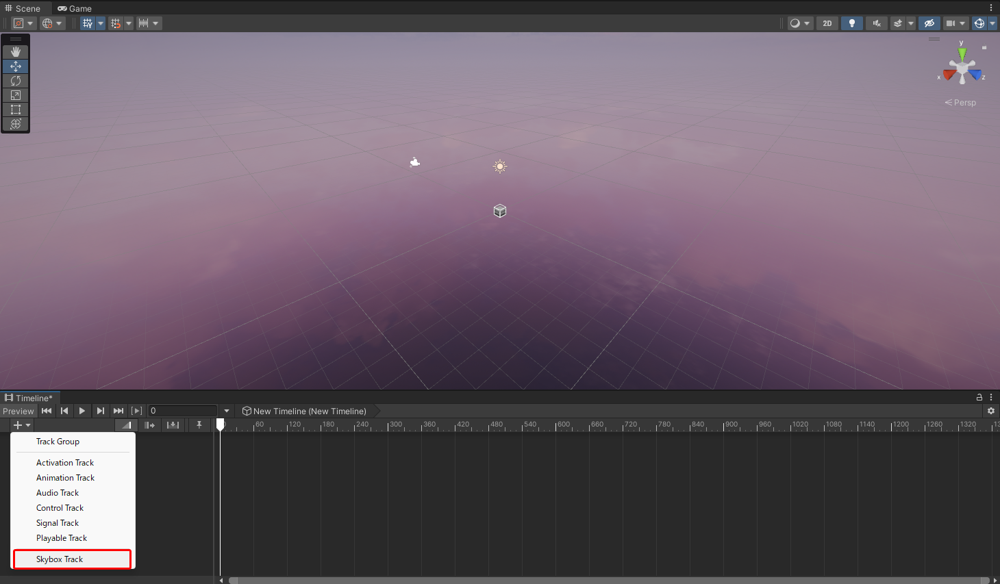

# SkyboxTimeline

## Overview

Unity の Timeline 上で skybox material を切り替えるための track を追加する。  
skybox material の mix には非対応。

## 開発環境

-   Unity: 2021.3.27f1
-   OS: Windows11

## 使い方

1. Script を UnityEditor に取り込む
   

2. ` Timeline` で `Skybox Time` を追加し、skybox material を複数追加する

https://github.com/vshige/SkyboxTimeline/assets/98008312/79783dc2-04cf-46f9-9a92-de7d8002bdb6

